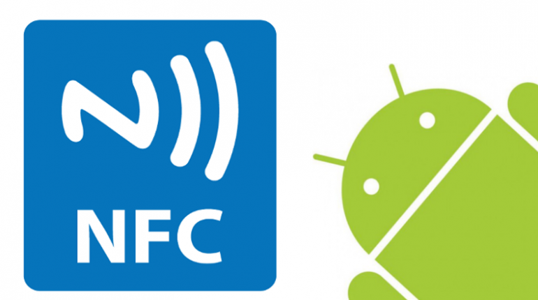

The application shows basic NFC functionality.

It supports writing NFC tags in following formats TNF:

 - TNF_MIME_MEDIA (vCard mime type and custom application mime type.)
 - TNF_WELL_KNOWN RTD_URI
 
Reading NFC tags:

 - TNF_MIME_MEDIA custom application mime type
    - With intent filter in AndroidManifest and as Foreground Dispatch System
    
For data encryption <a href="https://github.com/simbiose/Encryption">se.simbio.encryption:library:1.2.0</a> is used under GNU Lesser General Public License at version 3.